<h2>TensorFlow-FlexUNet-Image-Segmentation-CURVAS-Abdominal-MultiOrgan (2026/04/02)</h2>
Sarah T. Arai 
Software Laboratory antillia.com  
This is the first experiment of Image Segmentation for <b>CURVAS-Abdominal-MultiOrgan</b> based on 
our <a href="./src/TensorFlowFlexUNet.py">TensorFlowFlexUNet</a>
 (<b>TensorFlow Flexible UNet Image Segmentation Model for Multiclass</b>), and a 512x512 pixels PNG
 <a href="https://drive.google.com/file/d/11_cuziE1DGnlb9f2YLmYAD-xc0gi7c5x/view?usp=sharing">
CURVAS-MultiAnnotations-ImageMask-Dataset.zip</a> 
(<a href="https://creativecommons.org/licenses/by-nc/4.0/deed.en">CC BY-NC</a>), which was derived by us from   
<b>training_data (multi-annotations)</b> in 
<a href="https://zenodo.org/records/11147560">
CURVAS dataset</a> on the zenodo.org
  

<b>Comparison of Image Segmentation for CURVAS Abdominal MultiOrgan Images</b> 
As shown below, the three colorized multi-organ regions appear similar to each other, which were obtained by calling  
a prediction method of the segmentation models trained by three multi annotation datasets. 
  
<b>class_color_map = {Pancreas:cyan, Kidney:yellow, Liver:mazenta}</b>
  
<table>
<tr>
<th  width="240" height="auto">Input: image</th>
<th  width="240" height="auto">Prediction:Annotation-1</th>
<th width="240" height="auto">Prediction:Annotation-2</th>
<th  width="240" height="auto">Prediction:Annotation-3</th>
</tr>
<tr>
<td>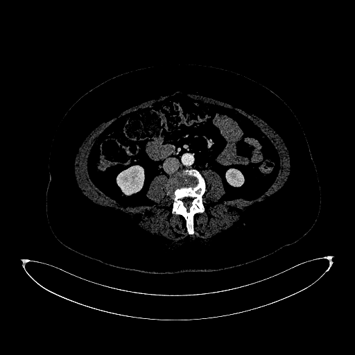</td>
<td></td>
<td></td>
<td></td>
</tr>

<tr>
<td>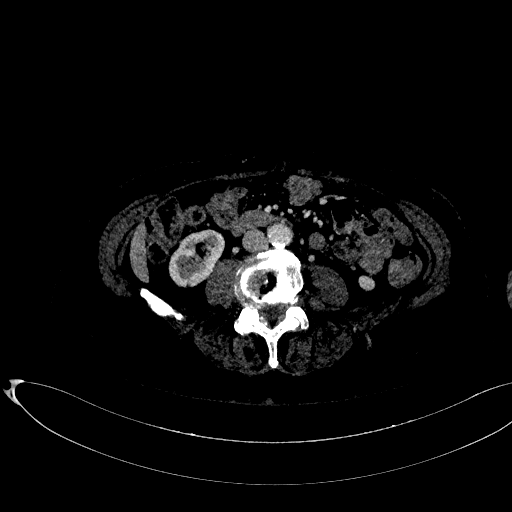</td>
<td>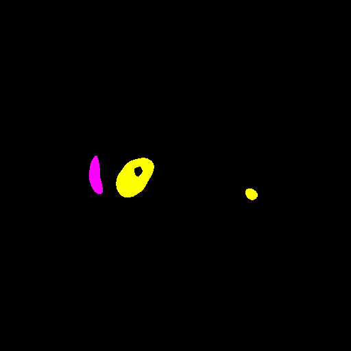</td>
<td>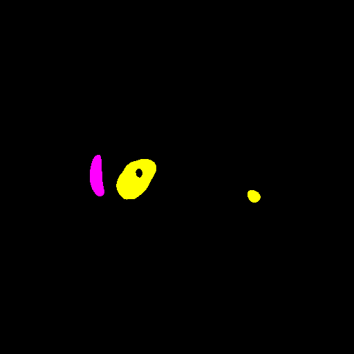</td>
<td>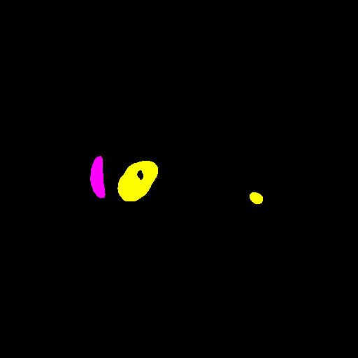</td>
</tr>
<tr>
<td>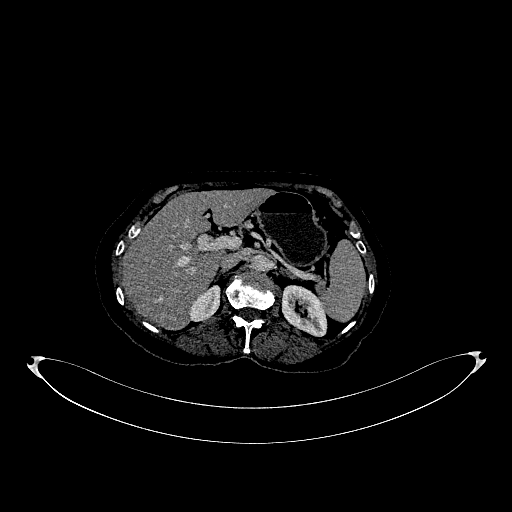</td>
<td>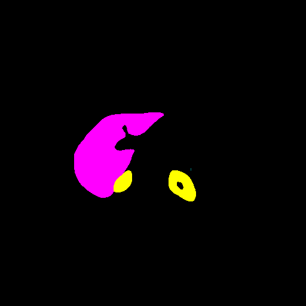</td>
<td></td>
<td>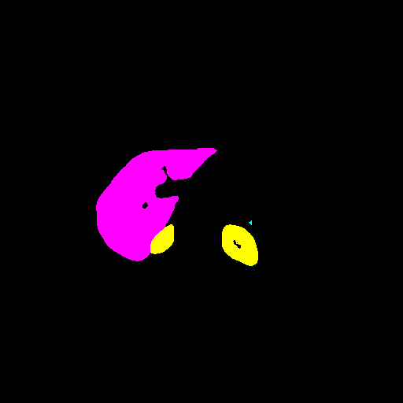</td>
</tr>
<tr>
<td>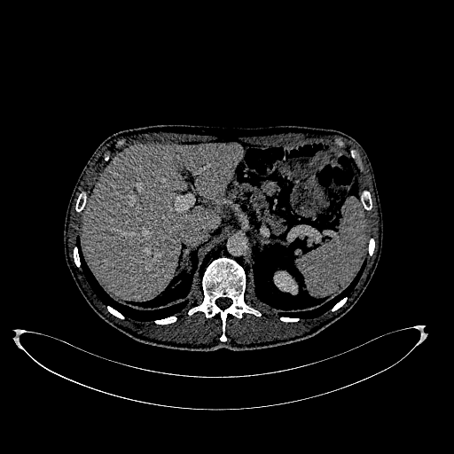</td>
<td>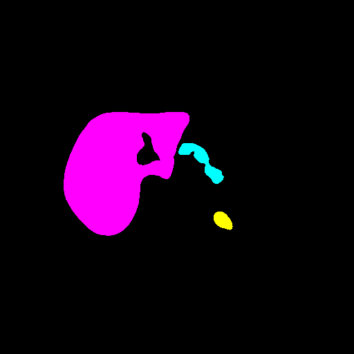</td>
<td>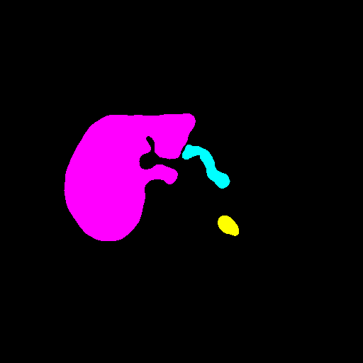</td>
<td></td>
</tr>
<tr>
<td>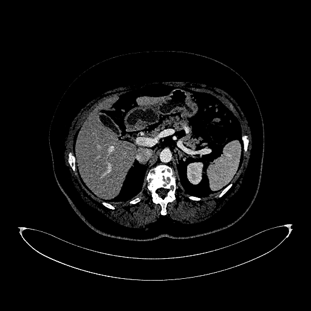</td>
<td></td>
<td></td>
<td></td>
</tr>
<tr>
<td>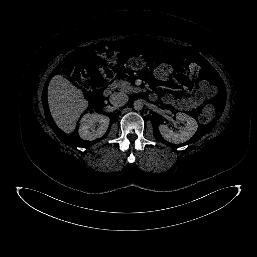</td>
<td></td>
<td>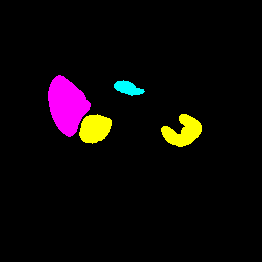</td>
<td></td>
</tr>
</table>

 
<h3>1. Dataset Citation</h3>
The dataset used here was taken from   
<b>training_data (multi-annotations)</b> in 
<a href="https://zenodo.org/records/11147560">
CURVAS dataset</a> on the zenodo.org
  
For more information, please refer to <a href="https://curvas.grand-challenge.org/"><b>CURVAS MICCAI2024</b>.</a>
  
The following explanations (excerpts) were taken from the above zenodo web site.  
<b>CURVAS Challenge Goal</b> 
Due to all the previously stated reasons, we have created a challenge that considers all of the above. 
In this challenge, we will work with abdominal CT scans. Each of them will have three different annotations obtained 
from different experts and each of the annotations will have three classes: pancreas, kidney and liver.
  
The main idea is to be able to evaluate the results considering the multi rater information. 
There will be three separate evaluations: firstly, a classical dice score evaluation together with an uncertainty study will be performed; secondly, a volumetric assessment to give relevant clinical information will take place; finally, a study on whether the model is calibrated or not will take place. 
All of these evaluations will be performed considering all three different annotations.
  
For more information about the challenge, visit our website to join CURVAS (Calibration and Uncertainty for multiRater Volume Assessment 
in multiorgan Segmentation).   
This challenge will be held in <a href="https://conferences.miccai.org/2024/en/">MICCAI 2024.</a>
  
<b>Dataset Cohort</b>
The challenge cohort consists of 90 CT images prospectively gathered at the University Hospital Erlangen between August 2023 and October 2023. Each CT will have multiple classes: background (0), pancreas (1), kidney (2) and liver (3). In addition, each of the CTs will have three different annotators 
from three different experts that will contain the four classes specified previously.
 
<ul>
<li><b>Training Phase cohort:</b> 
20 CT scans belonging to group A with the respective annotations will be given. It is encouraged to leverage publicly available external data annotated by multiple raters. The idea of giving a small amount of data for the training set and giving the opportunity of using a public dataset for training is to make the challenge more inclusive, giving the option to develop a method by using data that is in anyone's hands. Furthermore, by using 
this data to train and using other data to evaluate, it makes it more robust to shifts and other sources of variability between datasets.
</li>
<li><b>Validation Phase cohort:</b> 
5 CT scans belonging to group A will be used for this phase.
</li>
<li><b>Test Phase cohort:</b> 
65 CT scans will be used for evaluation. 20 CTs belonging to group A, 22 CTs belonging to group B and 23 CTs belonging to group C.
 
Both validation and testing CT scans cohorts will not be published until the end of the challenge.  
Furthermore, to which group each CT scan belongs will not be revealed until after the challenge.
</li>
</ul>
 
<b>Annotation Protocol</b> 
The first step for obtaining de labels was using the <a href="https://github.com/wasserth/TotalSegmentator">TotalSegmentator [1] [2]</a> to get rough annotations. Then, the labels were sent to three radiologists (R1, R2, R3), to both correct the automatic annotations and add possible missing organs. 
One of the three labeling radiologists, the MD PhD candidate, previously defined both the dataset cohort and the criteria of what belongs to the parenchyma and what does not and it was given to the other two labeling radiologists to follow the same criteria to be coherent with each other [3]. 
Separately, two other clinicians (C1, C2) supervised the criteria of the cohort defined by the MD PhD candidate, but not having any relation with the labeling itself, hence, there is no bias between the annotations of the different radiologists.
  
Each labeled class for this challenge has specific instructions. Below are listed per organ.
 
<ul>
<li><b>Liber:</b> 
Generally speaking, we define the liver 'as the entire liver tissue including all internal structures like vessel systems, tumors etc.' [4] Thus, the portal vein itself is excluded from contouring. The two main branches of the portal vein are excluded from the segmentation. 
Any branch of the following generations is included. 'In case of partial enclosure (occurring where large vessels as Vena Cava and portal vein enter or leave the liver), the parts enclosed by liver tissue are included in the segmentation, thus forming the convex hull of the liver shape.' [4] Any fatty tissue that pulls into the liver is excluded. 
The gallbladder should not be marked. 
Wide and especially pathologically widened bile ducts are included in the segmentation of the liver.
</li>
<li><b>Kidney</b> 
The right and left kidney will be segmented. Included in the segmentation will be the kidney parenchyma including the renal medulla. Excluded is the renal pelvis [5] and the ureter as a urinary stasis could alter the original volume.
</li>
<li><b>Pancreas:</b> 
The right and left kidney will be segmented. Included in the segmentation will be the kidney parenchyma including the renal medulla. Excluded is the renal pelvis [5] and the ureter as a urinary stasis could alter the original volume.
</li>
</ul>
<b>License</b> 
<a href="https://creativecommons.org/licenses/by-nc/4.0/deed.en">
CC BY-NC (Creative Commons Attribution-NonCommercial)
</a>
 
<h3>
<a id="2">
2 CURVAS-Annotation ImageMask Dataset
</a>
</h3>
<h3>2.1 Download PNG CURVAS-Annotations Dataset</h3>
 If you would like to train this Abdominal-MultiOrgan Segmentation model by yourself,
 please download the dataset from the google drive our PNG
 <a href="https://drive.google.com/file/d/11_cuziE1DGnlb9f2YLmYAD-xc0gi7c5x/view?usp=sharing">
CURVAS-MultiAnnotations-ImageMask-Dataset.zip</a> (<a href="https://creativecommons.org/licenses/by-nc/4.0/deed.en">CC BY-NC</a>)
, expand the downloaded ImageMaskDataset and put it under <b>./dataset</b> folder to be:
 
<pre>
./dataset
├─CURVAS-Annotation-1
│   ├─test
│   │   ├─images
│   │   └─masks
│   ├─train
│   │   ├─images
│   │   └─masks
│   └─valid
│        ├─images
│        └─masks
├─CURVAS-Annotation-2
│   ├─test
│   │   ├─images
│   │   └─masks
│   ├─train
│   │   ├─images
│   │   └─masks
│   └─valid
│        ├─images
│        └─masks
└─CURVAS-Annotation-3
     ├─test
     │   ├─images
     │   └─masks
     ├─train
     │   ├─images
     │   └─masks
     └─valid
          ├─images
          └─masks
</pre>
 
As shown above, the CURVAS-MultiAnnotations contains three types of Annotations sub-dataset. 
<table>
<tr>
<th>Annotation-1:Statistics</th>
<th>Annotation-2:Statistics</th>
<th>Annotation-3:Statistics</th>
</tr>
<tr>
<td></td>
<td>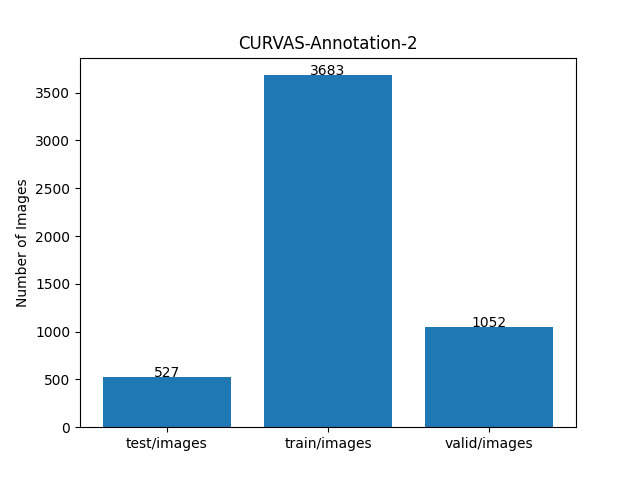</td>
<td></td>
</tr>
</table>
  
<h3>2.2 Derivation of dataset</h3>
We used a simple Python script 
<!--
<a href="./generator/ImageMaskDatasetGenerator.py">
ImageMaskDatasetGenerator.py</a> 
-->
and 
<b>class_color_map = {Pancreas:cyan, Kidney:yellow, Liver:mazenta}</b> 
to generate the PNG CURVAS-MultiAnnotations dataset with colorized masks from the original three types of NIfTI annotation files which
were created by multi-raters. For simplicity, we excluded all black empty masks and their correspoinding images 
to generate it. 
 
<!--
 
Please run the following command to generate a sub-dataset by specifying an annotation type number (1,2,3) as 
the command-line argument. 
<pre>
>python ImageMaskDatasetGenerator.py number
</pre>
 --> 
 
<h3>2.3 Train Image Mask Samples of Annotation-1</h3>
<b>Train_images_sample</b> 
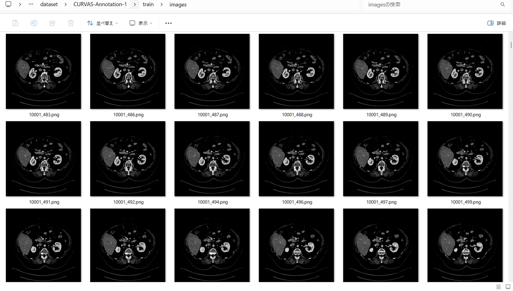
 
<b>Train_masks_sample</b> 
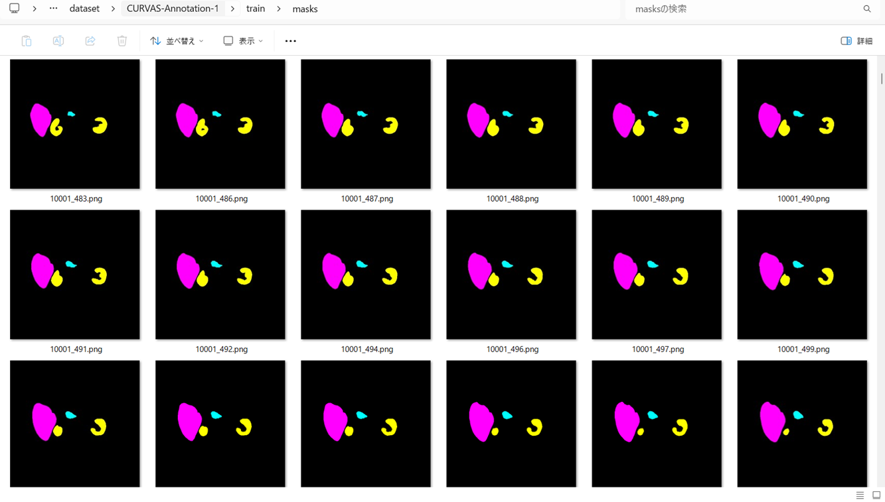
 
 
<h3>2.4 Projects Folder Structure</h3>
As illustrated below, <b>./projects/TensorFlowFlexUNet</b> folder contains three sub-folders corresponding
to the three Annotations dataset. 
Each sub-folder contains four bat files to train, evaluate, infer and compare for the 
FlexUNet model, and two configuration files. 
Please move to those sub-folders, and run three bat files in each sub-folder to train FlexUNetModel corresponding
to the annotation in <b>./dataset</b> folder. 
<pre>
./projects
└─TensorFlowFlexUNet
    ├─CURVAS-Annotation-1
    │   ├─1.train.bat
    │   ├─2.evaluate.bat
    │   ├─3.infer.bat
    │   ├─5.predict.bat
    │   ├─predict.config
    │   └─train_eval_infer.config    
    ├─CURVAS-Annotation-2
    │   ├─1.train.bat
    │   ├─2.evaluate.bat
    │   ├─3.infer.bat
    │   ├─5.predict.bat
    │   ├─predict.config
    │   └─train_eval_infer.config    
    └─CURVAS-Annotation-3
         ├─1.train.bat
         ├─2.evaluate.bat
         ├─3.infer.bat
         ├─5.predict.bat
         ├─predict.config
         └─train_eval_infer.config    
</pre>
 
<h3>2.4.1 bat files </h3>
Please use the following bat files to train, evaluate, infer and predict methods of our FlexUNet Model.  
<b>1.train.bat</b> runs the following command. 
<pre>
python ../../../src/TensorFlowFlexUNetTrainer.py ./train_eval_infer.config
</pre>
 
<b>2.evaluate.bat</b> runs the following command.
<pre>
python ../../../src/TensorFlowFlexUNetEvaluator.py ./train_eval_infer.config
</pre>
 
<b>3.infer.bat </b> runs the following command.
<pre>
python ../../../src/TensorFlowFlexUNetInferencer.py ./train_eval_infer.config
</pre>
<b>5.predict.bat </b> runs the following command.
<pre>
python ../../../src/TensorFlowFlexUNetInferencer.py ./predict.config
</pre>
 
<h3>2.4.2 Configuration file</h3>
The configuration file <b>train_eval_infer.config </b> contains the following parameters
on train, eval and infer methods of the FlexUNet Model. 
 
<b>Model parameters</b> 
Defined a small <b>base_filters = 16 </b> and large <b>base_kernels = (11,11)</b> for the first Conv Layer of Encoder Block of 
<a href="./src/TensorFlowFlexUNet.py">TensorFlowFlexUNet.py</a> 
and a large num_layers (including a bridge between Encoder and Decoder Blocks).
<pre>
[model]
;You may specify your own UNet class derived from our TensorFlowFlexModel
model         = "TensorFlowFlexUNet"
image_width    = 512
image_height   = 512
image_channels = 3
input_normalize = True
normalization  = False
num_classes    = 5
base_filters   = 16
base_kernels   = (11,11)
num_layers     = 8
dropout_rate   = 0.05
dilation       = (1,1)
</pre>
<b>Learning rate</b> 
Defined a small learning rate.  
<pre>
[model]
learning_rate  = 0.00007
</pre>
<b>Loss and metrics functions</b> 
Specified "categorical_crossentropy" and <a href="./src/dice_coef_multiclass.py">"dice_coef_multiclass"</a>. 
<pre>
[model]
loss           = "categorical_crossentropy"
metrics        = ["dice_coef_multiclass"]
</pre>
<b>Dataset class</b> 
Specifed <a href="./src/ImageCategorizedMaskDataset.py">ImageCategorizedMaskDataset</a> class. 
<pre>
[dataset]
class_name    = "ImageCategorizedMaskDataset"
</pre>
 
<b>Learning rate reducer callback</b> 
Enabled learing_rate_reducer callback, and a small reducer_patience.
<pre> 
[train]
learning_rate_reducer = True
reducer_factor     = 0.4
reducer_patience   = 4
</pre>
<b>Early stopping callback</b> 
Enabled early stopping callback with patience parameter.
<pre>
[train]
patience      = 10
</pre>
<b>RGB Color map</b> 
Specifed rgb color map dict for CURVAS-Annotation-1 1+2 classes. 
<pre>
[mask]
mask_datatyoe    = "categorized"
mask_file_format = ".png"
;CURVAS-Annotation-1 1+2 classes.
rgb_map = {(0,0,0):0, (0,255,0):1,(255,0,0):2, }
</pre>
<b>Epoch change inference callback</b> 
Enabled <a href="./src/EpochChangeInferencer.py">epoch_change_infer callback</a></b>. 
<pre>
[train]
epoch_change_infer       = True
epoch_change_infer_dir   =  "./epoch_change_infer"
num_infer_images         = 6
</pre>
By using this callback, on every epoch_change, the inference procedure can be called
 for 6 images in <b>mini_test</b> folder. This will help you confirm how the predicted mask changes 
 at each epoch during your training process.  
 
<h3>
3 CURVAS-Annotation-1
</h3>
<h3>3.1 Train TensorFlowFlexUNet Model
</h3>
 We trained CURVAS-Annotation-1 TensorFlowFlexUNet Model by using the 
<a href="./projects/TensorFlowFlexUNet/CURVAS-Annotation-1/train_eval_infer.config"> <b>train_eval_infer.config</b></a> file.  
Please move to ./projects/TensorFlowFlexUNet/CURVAS-Annotation-1 and run the following bat file. 
<pre>
>1.train.bat
</pre>
In this experiment, the training process was terminated at epoch 60.  
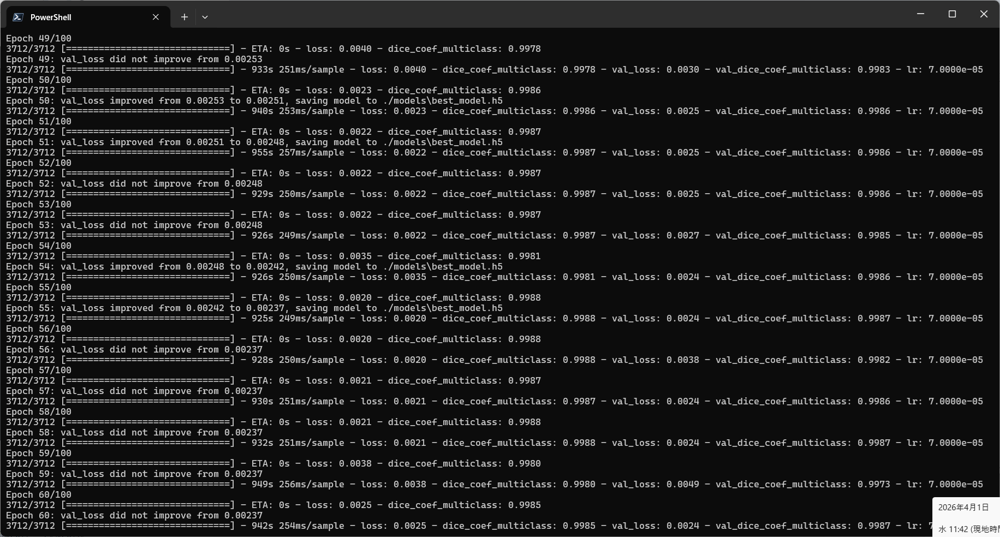 
 

<a href="./projects/TensorFlowFlexUNet/CURVAS-Annotation-1/eval/train_metrics.csv">train_metrics.csv</a> 
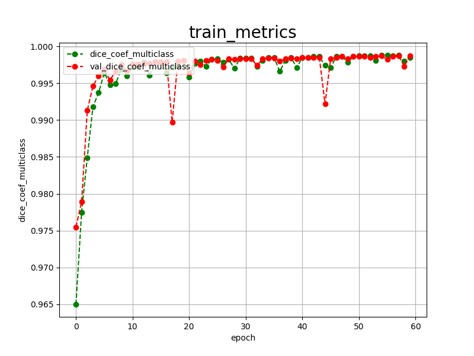 

 
<a href="./projects/TensorFlowFlexUNet/CURVAS-Annotation-1/eval/train_losses.csv">train_losses.csv</a> 
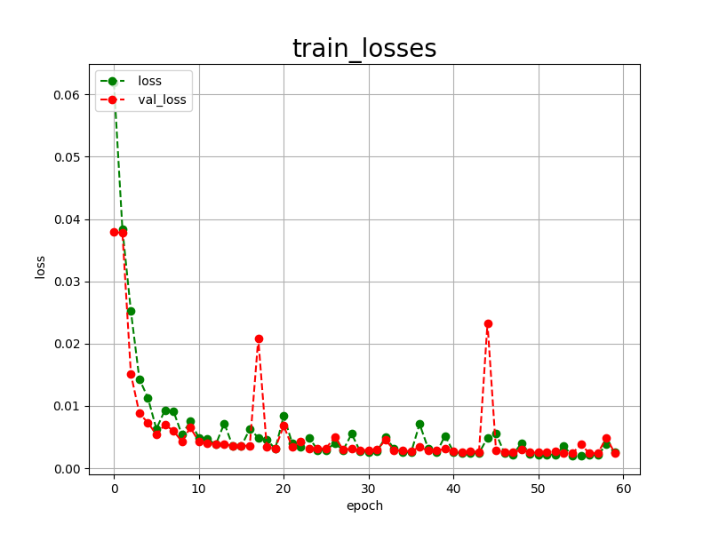
 
<h3>
3.2 Evaluation
</h3>
Please move to <b>./projects/TensorFlowFlexUNet/CURVAS-Annotation-1</b> folder, 
and run the following bat file to evaluate TensorFlowUNet model for CURVAS-Annotation-1. 
<pre>
>./2.evaluate.bat
</pre>
Evaluation console output: 
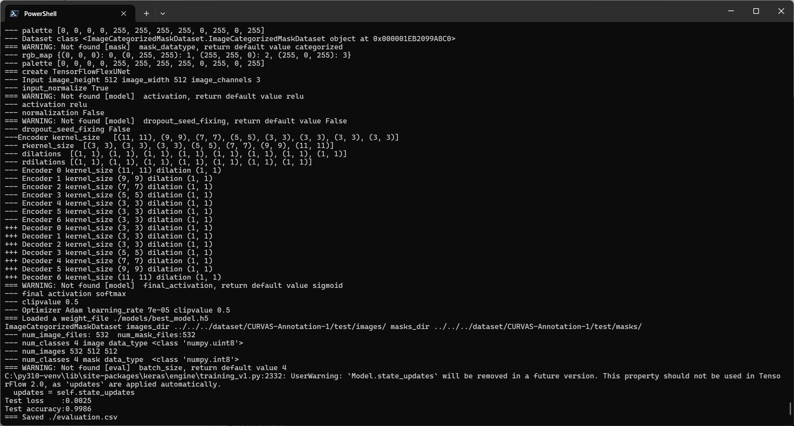
  Image-Segmentation-CURVAS-Annotation-1

<a href="./projects/TensorFlowFlexUNet/CURVAS-Annotation-1/evaluation.csv">evaluation.csv</a> 
The loss (categorical_crossentropy) to this <b>CURVAS-Annotation-1/test</b> was very low, and dice_coef_multiclass very high as shown below.
 
<pre>
categorical_crossentropy,0.0025
dice_coef_multiclass,0.9986
</pre>
 
<h3>3.3 Inference</h3>
Please move to a <b>./projects/TensorFlowFlexUNet/CURVAS-Annotation-1</b> folder, and run the following bat file to 
infer segmentation regions for <b>./mini_test/images</b> by the Trained-TensorFlowUNet model for CURVAS-Annotation-1. 
<pre>
>./3.infer.bat
</pre>

<b>mini_test_images</b> 
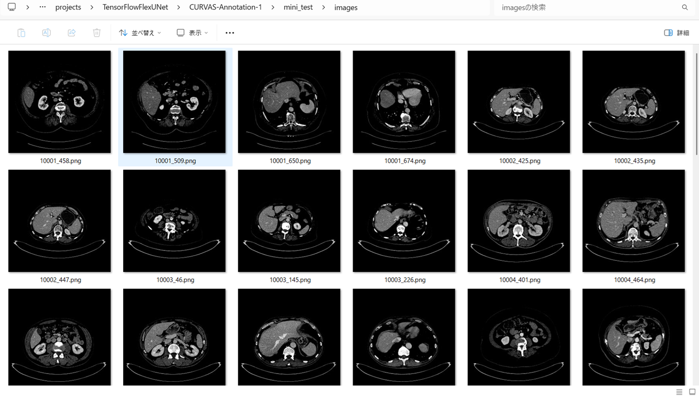 
<b>mini_test_mask(ground_truth)</b> 
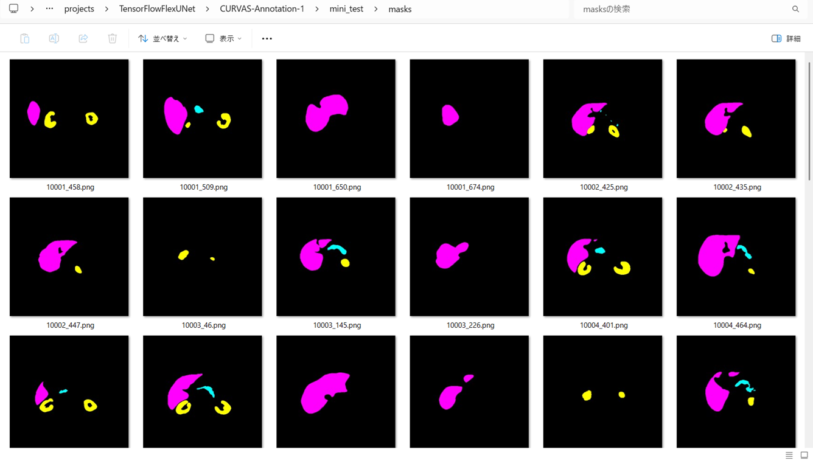 

<b>Inferred test masks</b> 
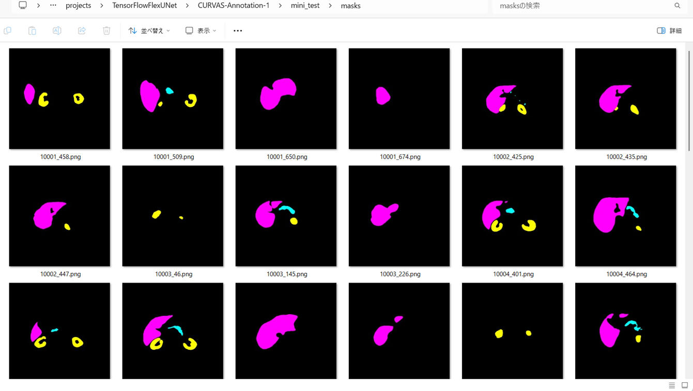 
 

<b>Enlarged images and masks of CURVAS-Annotation-1 Images of 512x512 pixels</b> 
As shown below, the inferred masks predicted by our segmentation model trained by the dataset appear similar to the
ground truth masks.
  
<b>class_color_map = {Pancreas:cyan, Kidney:yellow, Liver:mazenta}</b>
  
<table>
<tr>
<th>Image</th>
<th>Mask (ground_truth)</th>
<th>Inferred-mask</th>
</tr>
<tr>
<td>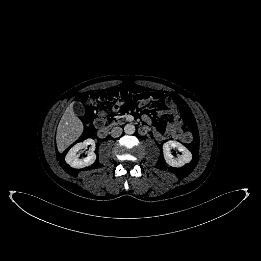</td>
<td></td>
<td></td>
</tr>

<tr>
<td>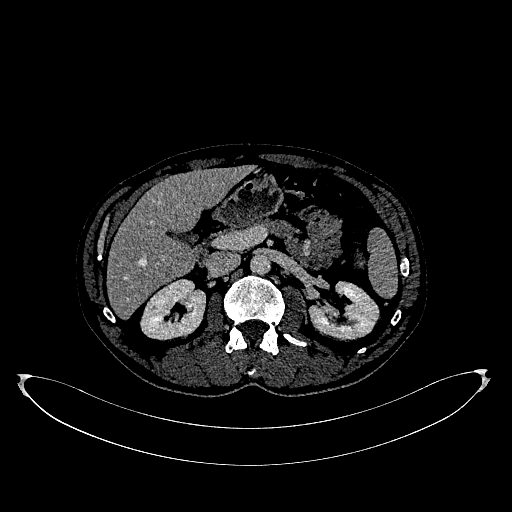</td>
<td></td>
<td>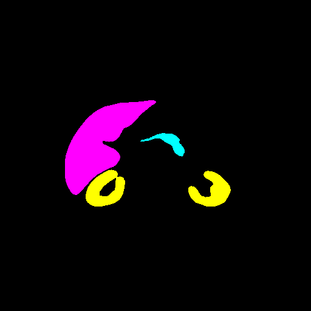</td>
</tr>

<tr>
<td>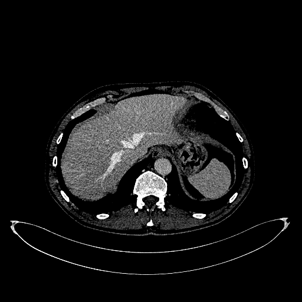</td>
<td>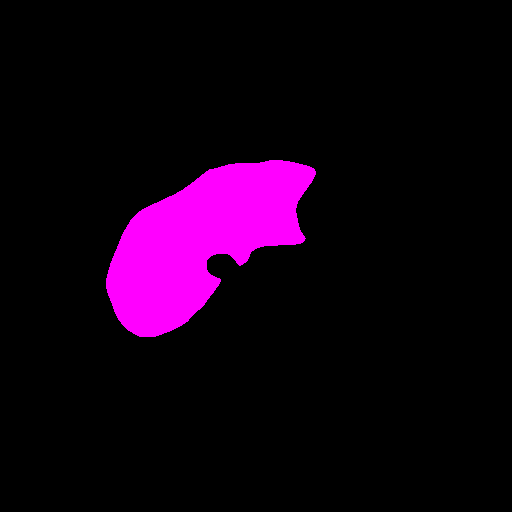</td>
<td></td>
</tr>

<tr>
<td>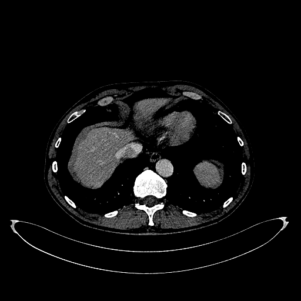</td>
<td></td>
<td></td>
</tr>

<tr>
<td></td>
<td></td>
<td></td>
</tr>

<tr>
<td></td>
<td></td>
<td></td>
</tr>
</table>

 
<h3>
3.4 Prediction for Comparison
</h3>
Please move to a <b>./projects/TensorFlowFlexUNet/CURVAS-Annotation-1</b> folder, and run the following bat file 
to predict multi-organ regions for <b>./compare/images</b> by the Trained-TensorFlowUNet model for CURVAS-Annotation-1. 
<pre>
>./5.predict.bat
</pre>
 
<h3>
4 CURVAS-Annotation-2
</h3>
<h3>4.1 Train TensorFlowFlexUNet Model
</h3>
 We trained CURVAS-Annotation-2 TensorFlowFlexUNet Model by using the 
<a href="./projects/TensorFlowFlexUNet/CURVAS-Annotation-2/train_eval_infer.config"> <b>train_eval_infer.config</b></a> file.  
Please move to ./projects/TensorFlowFlexUNet/CURVAS-Annotation-2 and run the following bat file. 
<pre>
>1.train.bat
</pre>
In this experiment, the training process was terminated at epoch 60.  
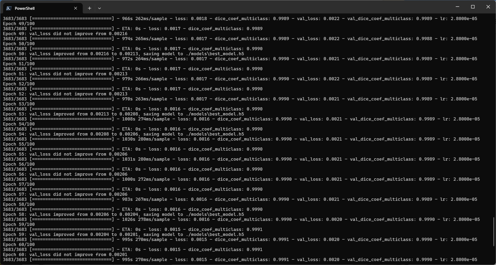 
 

<a href="./projects/TensorFlowFlexUNet/CURVAS-Annotation-2/eval/train_metrics.csv">train_metrics.csv</a> 
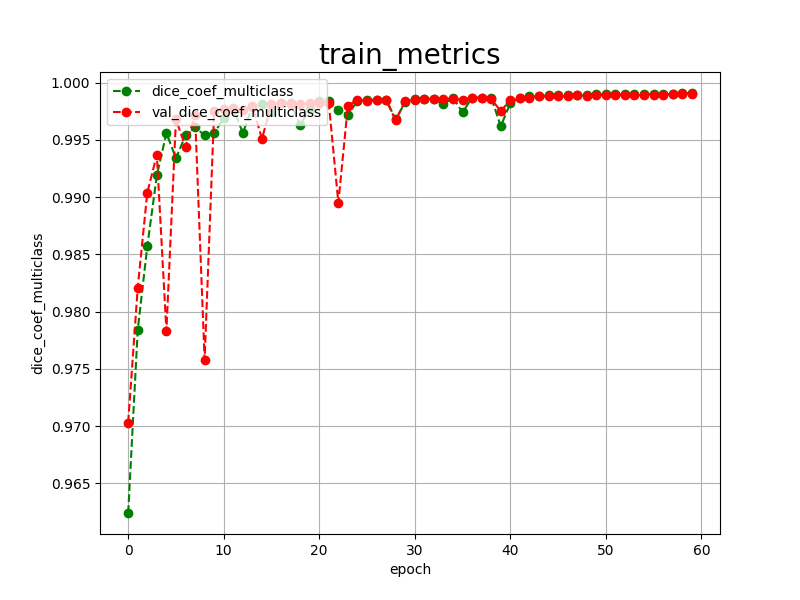 

 
<a href="./projects/TensorFlowFlexUNet/CURVAS-Annotation-2/eval/train_losses.csv">train_losses.csv</a> 
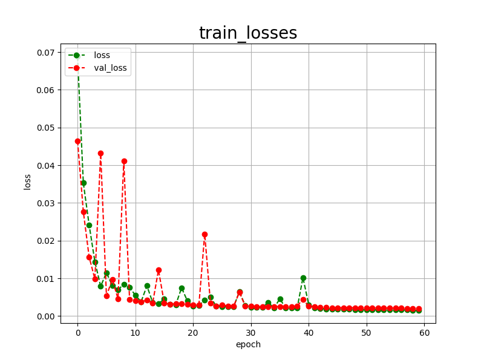
 
<h3>4.2 Evaluation</h3>
Please move to <b>./projects/TensorFlowFlexUNet/CURVAS-Annotation-2</b> folder, 
and run the following bat file to evaluate TensorFlowUNet model for CURVAS-Annotation-2. 
<pre>
>./2.evaluate.bat
</pre>
Evaluation console output: 
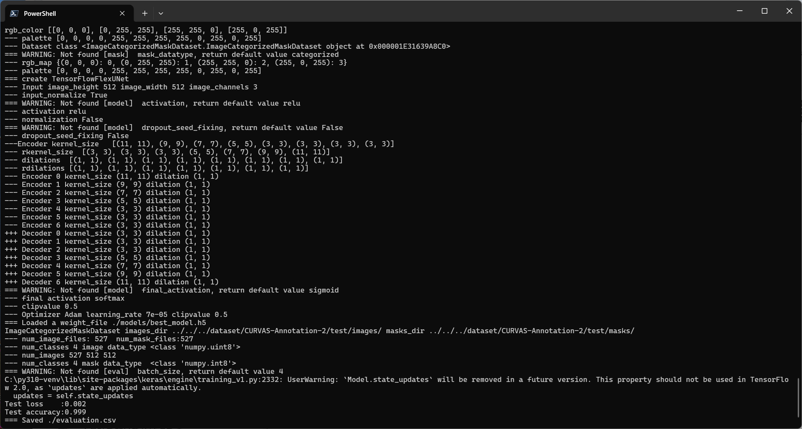
  Image-Segmentation-CURVAS-Annotation-2

<a href="./projects/TensorFlowFlexUNet/CURVAS-Annotation-2/evaluation.csv">evaluation.csv</a> 
The loss (categorical_crossentropy) to this <b>CURVAS-Annotation-2/test</b> was very low, and dice_coef_multiclass very high as shown below.
 
<pre>
categorical_crossentropy,0.002
dice_coef_multiclass,0.999
</pre>
 
<h3>4.3 Inference</h3>
Please move to a <b>./projects/TensorFlowFlexUNet/CURVAS-Annotation-2</b> folder, and run the following bat file to infer 
segmentation regions for <b>./mini_test/images</b> by the Trained-TensorFlowUNet model for CURVAS-Annotation-2. 
<pre>
>./3.infer.bat
</pre>

<b>mini_test_images</b> 
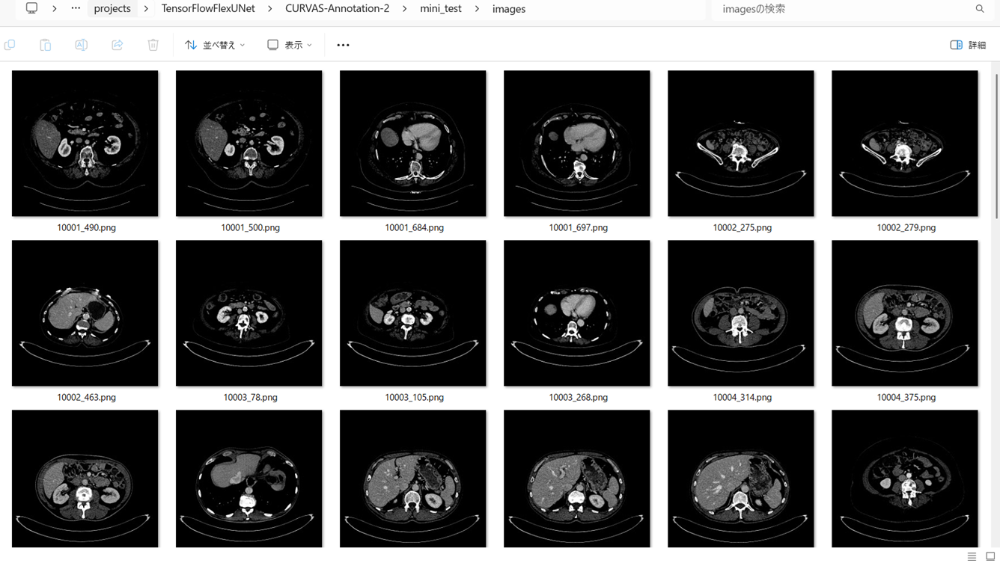 
<b>mini_test_mask(ground_truth)</b> 
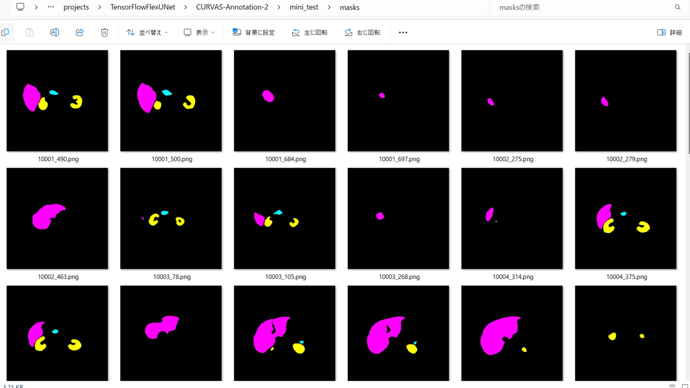 

<b>Inferred test masks</b> 
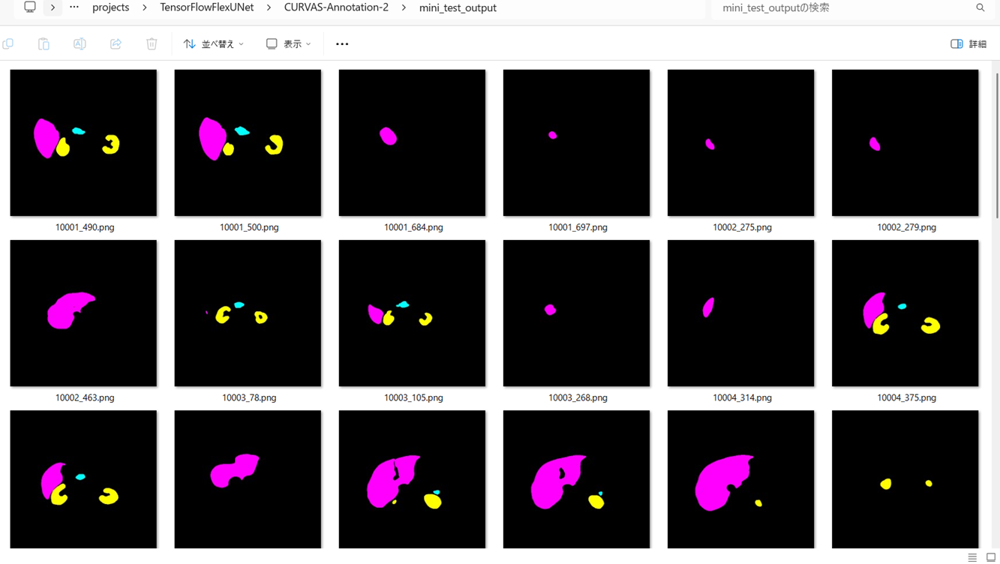 
 

<b>Enlarged images and masks of CURVAS-Annotation-2 Images of 512x512 pixels</b> 
As shown below, the inferred masks predicted by our segmentation model trained by the dataset appear similar to the
ground truth masks.
  
<b>class_color_map = {Pancreas:cyan, Kidney:yellow, Liver:mazenta}</b>
  
<table>
<tr>
<th>Image</th>
<th>Mask (ground_truth)</th>
<th>Inferred-mask</th>
</tr>
<tr>
<td>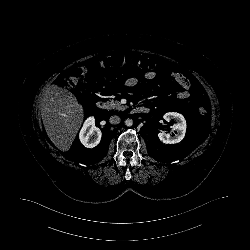</td>
<td></td>
<td>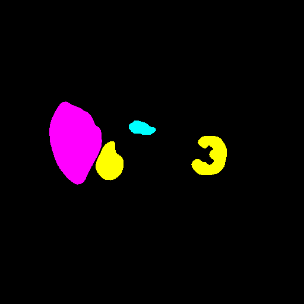</td>
</tr>

<tr>
<td>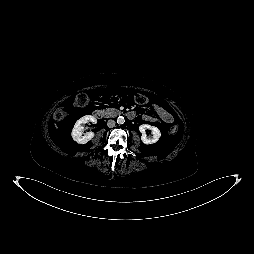</td>
<td></td>
<td></td>
</tr>

<tr>
<td>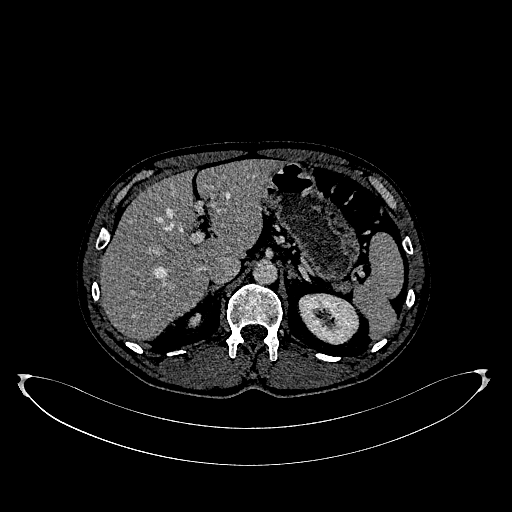</td>
<td>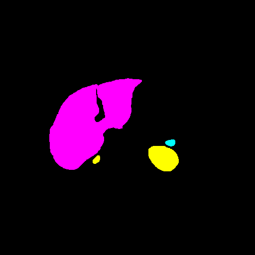</td>
<td></td>
</tr>

<tr>
<td>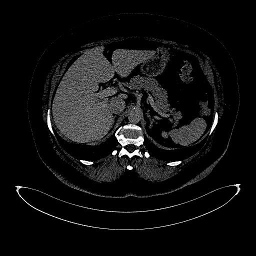</td>
<td>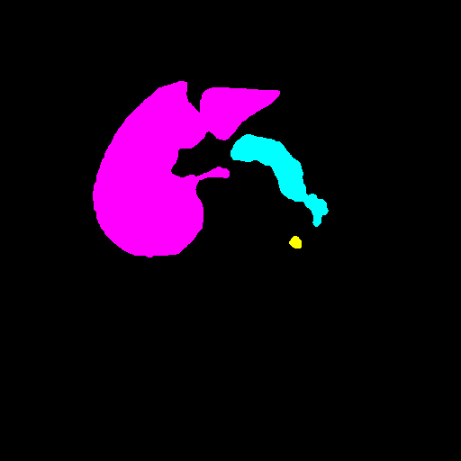</td>
<td></td>
</tr>

<tr>
<td>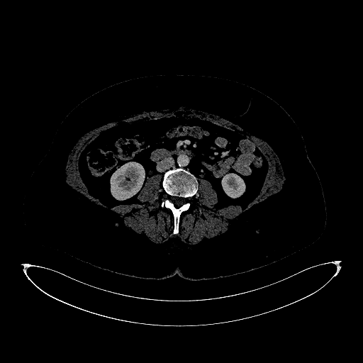</td>
<td></td>
<td></td>
</tr>

<tr>
<td>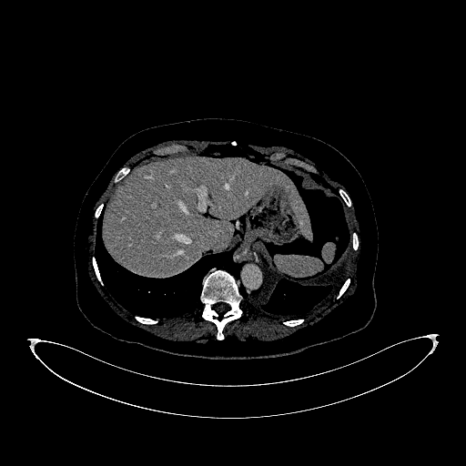</td>
<td></td>
<td>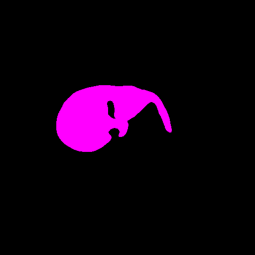</td>
</tr>
</table>

 
<h3>
4.4 Prediction for Comparison
</h3>
Please move to a <b>./projects/TensorFlowFlexUNet/CURVAS-Annotation-2</b> folder, and run the following bat file 
to predict multi-organ regions for <b>./compare/images</b> by the Trained-TensorFlowUNet model for CURVAS-Annotation-2. 
<pre>
>./5.predict.bat
</pre>

 
<h3>5 CURVAS-Annotation-3</h3>
<h3>5.1 Train TensorFlowFlexUNet Model
</h3>
 We trained CURVAS-Annotation-3 TensorFlowFlexUNet Model by using the 
<a href="./projects/TensorFlowFlexUNet/CURVAS-Annotation-3/train_eval_infer.config"> <b>train_eval_infer.config</b></a> file.  
Please move to ./projects/TensorFlowFlexUNet/CURVAS-Annotation-3 and run the following bat file. 
<pre>
>1.train.bat
</pre>

In this experiment, the training process was terminated at epoch 60.  
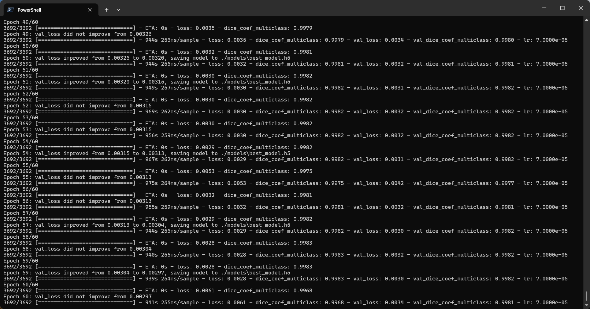 
 

<a href="./projects/TensorFlowFlexUNet/CURVAS-Annotation-3/eval/train_metrics.csv">train_metrics.csv</a> 
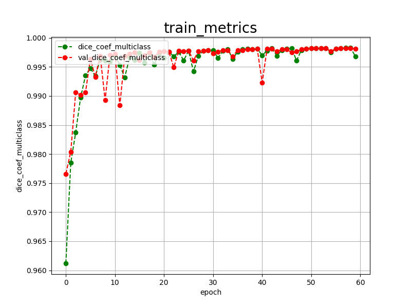 

 
<a href="./projects/TensorFlowFlexUNet/CURVAS-Annotation-3/eval/train_losses.csv">train_losses.csv</a> 
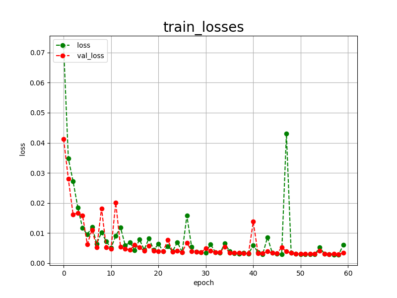
 
<h3>
5.2 Evaluation
</h3>
Please move to <b>./projects/TensorFlowFlexUNet/CURVAS-Annotation-3</b> folder, 
and run the following bat file to evaluate TensorFlowUNet model for CURVAS-Annotation-3. 
<pre>
>./2.evaluate.bat
</pre>
Evaluation console output: 
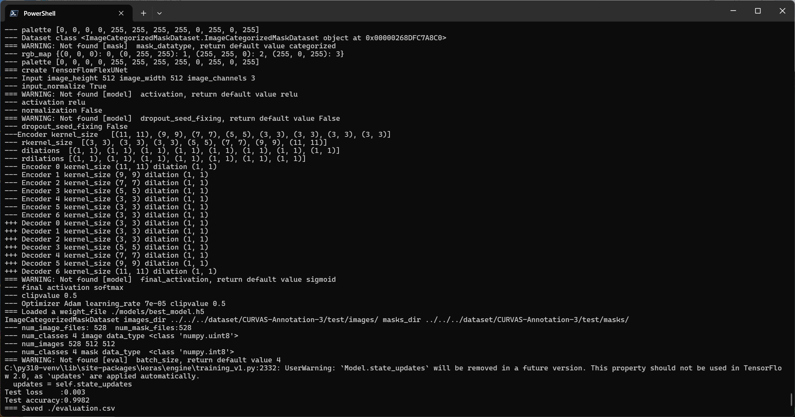
  Image-Segmentation-CURVAS-Annotation-3

<a href="./projects/TensorFlowFlexUNet/CURVAS-Annotation-3/evaluation.csv">evaluation.csv</a> 
The loss (categorical_crossentropy) to this <b>CURVAS-Annotation-3/test</b> was very low, and dice_coef_multiclass very high as shown below.
 
<pre>
categorical_crossentropy,0.003
dice_coef_multiclass,0.9982
</pre>
 
<h3>5.3 Inference</h3>
Please move to a <b>./projects/TensorFlowFlexUNet/CURVAS-Annotation-3</b> folder, and run the following bat file to infer 
segmentation regions for <b>./mini_test/images</b> by the Trained-TensorFlowUNet model for CURVAS-Annotation-3. 
<pre>
>./3.infer.bat
</pre>

<b>mini_test_images</b> 
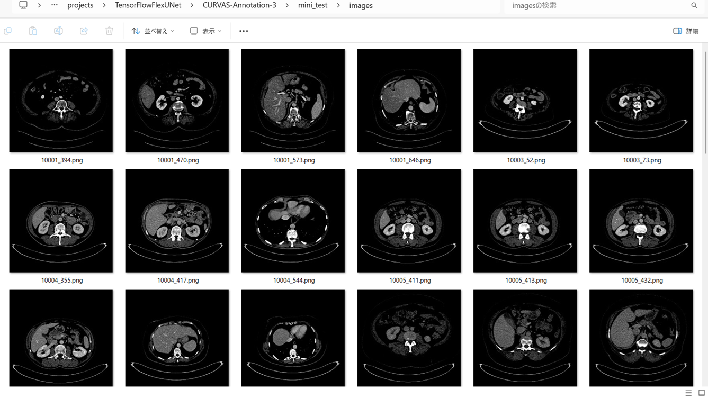 
<b>mini_test_mask(ground_truth)</b> 
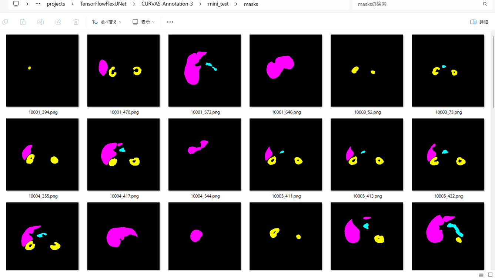 

<b>Inferred test masks</b> 
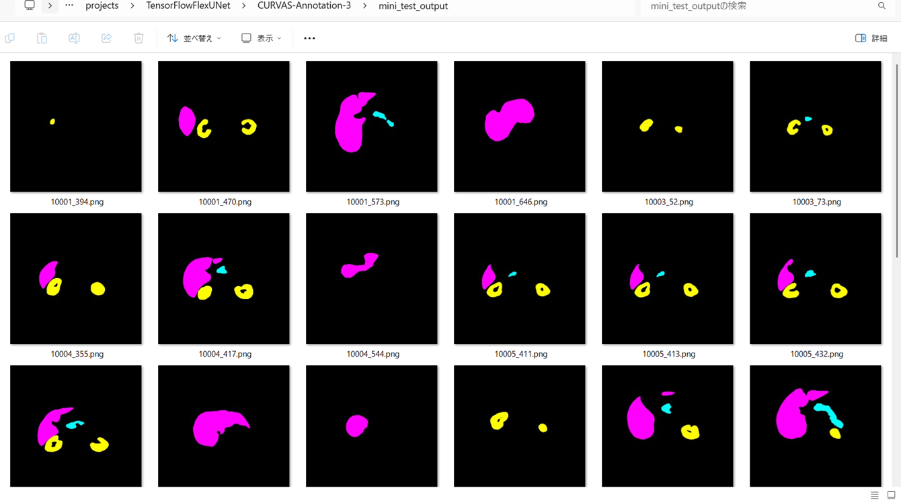 
 

<b>Enlarged images and masks of CURVAS-Annotation-3 Images of 512x512 pixels</b> 
As shown below, the inferred masks predicted by our segmentation model trained by the dataset appear similar to the 
ground truth masks.
  
<b>class_color_map = {Pancreas:cyan, Kidney:yellow, Liver:mazenta}</b>
  
<table>
<tr>
<th>Image</th>
<th>Mask (ground_truth)</th>
<th>Inferred-mask</th>
</tr>
<tr>
<td>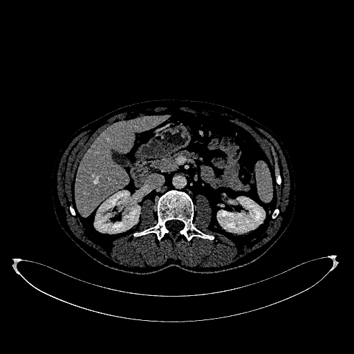</td>
<td>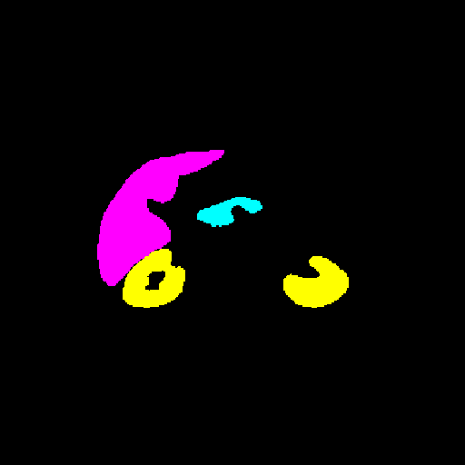</td>
<td></td>
</tr>

<tr>
<td>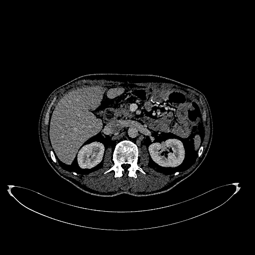</td>
<td>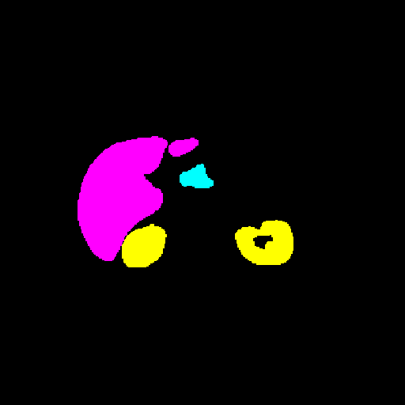</td>
<td></td>
</tr>

<tr>
<td>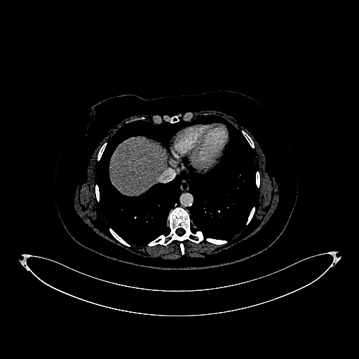</td>
<td></td>
<td></td>
</tr>

<tr>
<td>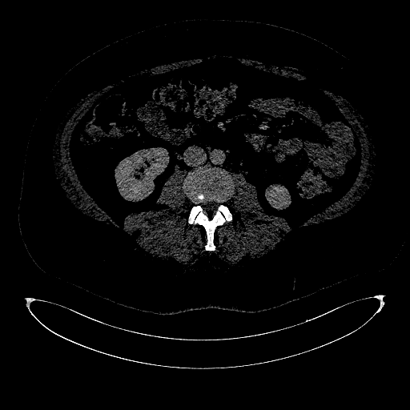</td>
<td></td>
<td>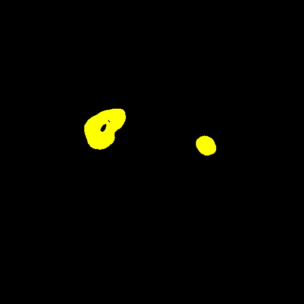</td>
</tr>

<tr>
<td>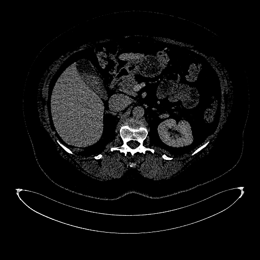</td>
<td></td>
<td>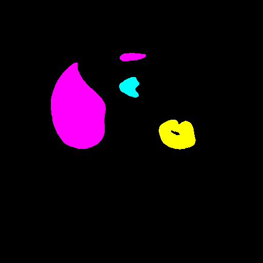</td>
</tr>

<tr>
<td>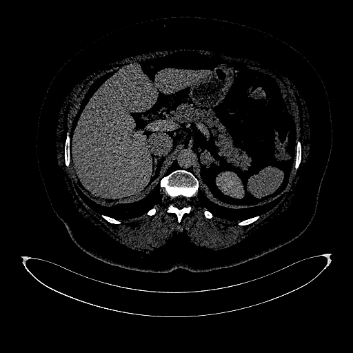</td>
<td></td>
<td>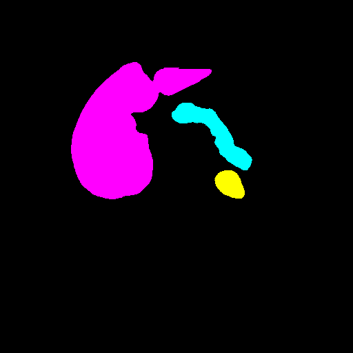</td>
</tr>
</table>

 
<h3>5.4 Prediction for Comparison</h3>
Please move to a <b>./projects/TensorFlowFlexUNet/CURVAS-Annotation-3</b> folder, and run the following bat file 
to predict multi-organ regions for <b>./compare/images</b> by the Trained-TensorFlowUNet model for CURVAS-Annotation-3. 
<pre>
>./5.predict.bat
</pre>
  
<h3>
References
</h3>
<b>1. A MultiRater MultiOrgan Abdominal CT Dataset for Calibration Analysis and Uncertainty Modeling in Segmentation</b> 
Meritxell Riera-Marin, Joy-Marie Kleiss, Anton Aubanell, Andreu Antolin, Juan Moreno-Vedia, Julia Rodriguez-Comas, Sikha O. K, Matthias May, 
 Javier Garcia-Lopez, Adrian Galdran & Miguel A. González Ballester  
<a href="https://pmc.ncbi.nlm.nih.gov/articles/PMC12873139/">https://pmc.ncbi.nlm.nih.gov/articles/PMC12873139/</a>
  
<b>2. Calibration and Uncertainty for multiRater Volume Assessment in multiorgan Segmentation (CURVAS) challenge results</b> 
Meritxell Riera-Marín,Sikha O K, Júlia Rodríguez-Comas, Matthias Stefan May, Zhaohong Pan, Xiang Zhou,  
Xiaokun Liang, Franciskus Xaverius Erick, Andrea Prenner, Cédric Hémon, Valentin Boussot, Jean-Louis Dillenseger,  
Jean-Claude Nunes, Abdul Qayyum, Moona Mazher, Steven A Niederer, Kaisar Kushibar, Carlos Martín-Isla,  
Petia Radeva, Karim Lekadir, Theodore Barfoot, Luis C. Garcia Peraza Herrera,Ben Glocker, Tom Vercauteren,  
Lucas Gago, Justin Englemann, Joy-Marie Kleiss, Andreu Antolin 
<a href="https://arxiv.org/html/2505.08685v2">https://arxiv.org/html/2505.08685v2</a>
  
<b>3. TensorFlow-FlexUNet-Image-Segmentation-MICCAI-FLARE22-Abdominal-Organ</b> 
Toshiyuki Arai  
<a href="https://github.com/sarah-antillia/TensorFlow-FlexUNet-Image-Segmentation-MICCAI-FLARE22-Abdominal-Organ">
https://github.com/sarah-antillia/TensorFlow-FlexUNet-Image-Segmentation-MICCAI-FLARE22-Abdominal-Organ
</a>
 
 
<b>4. TensorFlow-FlexUNet-Image-Segmentation-Abdominal-US</b> 
Toshiyuki Arai  
<a href="https://github.com/sarah-antillia/TensorFlow-FlexUNet-Image-Segmentation-Abdominal-US">
https://github.com/sarah-antillia/TensorFlow-FlexUNet-Image-Segmentation-Abdominal-US
</a>
 
 
<b>5. TensorFlow-FlexUNet-Image-Segmentation-Model</b> 
Toshiyuki Arai  
<a href="https://github.com/sarah-antillia/TensorFlow-FlexUNet-Image-Segmentation-Model">
https://github.com/sarah-antillia/TensorFlow-FlexUNet-Image-Segmentation-Model
</a>
 
 
